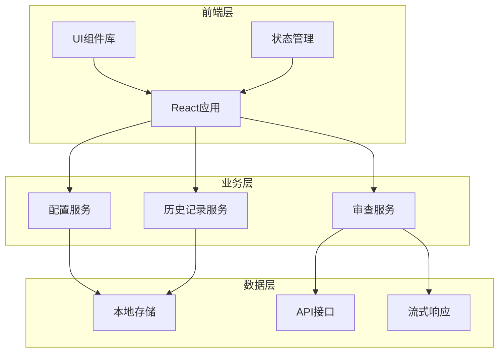
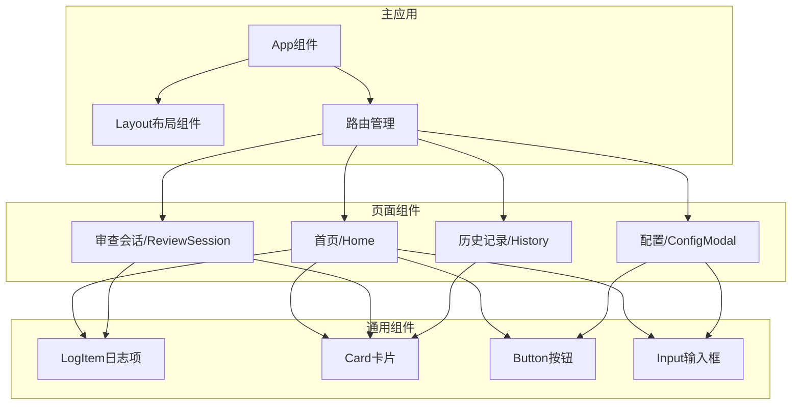
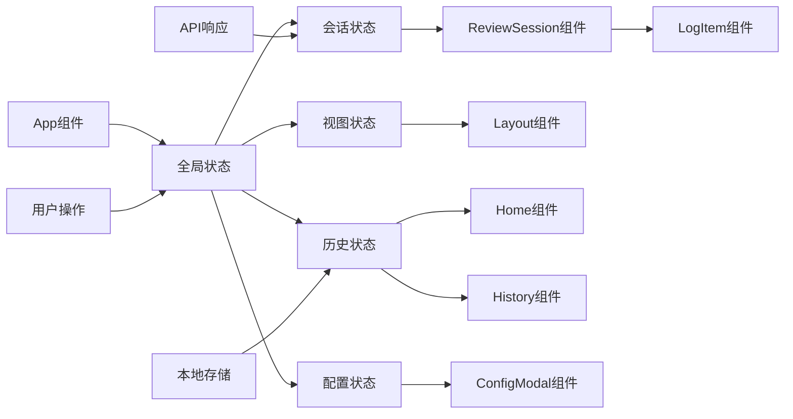

# CoStrict-CodeReview Web应用架构设计

## 1. 架构概述

### 1.1 架构目标

* **用户体验**: 提供现代简洁的深色主题Web界面，简化代码审查流程
* **功能完整性**: 实现代码审查仪表板、规则配置、历史记录和报告功能
* **可扩展性**: 支持多种AI模型和代码审查规则的自定义配置
* **性能**: 确保实时更新和响应式交互，即使在大量数据情况下也能保持流畅

### 1.2 架构原则

* **组件化设计**: 采用模块化组件架构，便于维护和扩展
* **响应式布局**: 确保在不同设备上都有良好的显示效果
* **实时性**: 通过流式处理实现实时更新审查进度
* **一致性**: 保持UI/UX设计的一致性，提供直观的用户体验

## 2. 系统架构

### 2.1 整体架构图



### 2.2 架构分层

#### 2.2.1 表示层

* **React应用**: 基于React 19 + TypeScript构建的现代Web应用
* **UI组件库**: 使用Framer Motion实现动画效果，Lucide React提供图标
* **样式系统**: 采用CSS变量和深色主题设计，确保视觉一致性

#### 2.2.2 业务层

* **审查服务**: 处理代码审查逻辑，与后端API交互
* **配置服务**: 管理AI模型和审查规则的配置
* **历史记录服务**: 处理审查历史记录的存储和检索

#### 2.2.3 数据层

* **本地存储**: 使用localStorage存储用户配置和历史记录
* **API接口**: 与后端服务交互，提交审查请求和获取结果
* **流式响应**: 通过Server-Sent Events实现实时更新

## 3. 页面结构设计

### 3.1 页面组件结构



### 3.2 页面功能描述

#### 3.2.1 首页 (Home)

* **主要功能**: 
  * 显示应用标题和简介
  * 提供模型选择输入框
  * 显示最近审查历史记录
  * 启动新审查会话的入口

* **关键组件**:
  * 模型输入框: 支持输入AI模型字符串
  * 历史记录卡片: 显示最近4条审查记录的摘要
  * 操作按钮: 配置、清除、开始审查

#### 3.2.2 审查会话 (ReviewSession)

* **主要功能**:
  * 实时显示审查进度
  * 展示审查日志和工具调用
  * 显示最终审查报告
  * 提供返回首页的导航

* **关键组件**:
  * 会话概览卡片: 显示状态、耗时、文件数、步骤数
  * 时间线: 展示审查过程中的每个步骤
  * 最终报告: 以Markdown格式显示审查结果

#### 3.2.3 历史记录 (History)

* **主要功能**:
  * 显示所有历史审查会话
  * 提供查看详情的入口
  * 支持按时间排序

* **关键组件**:
  * 历史记录网格: 以网格形式展示历史会话
  * 会话卡片: 显示模型、时间、摘要信息

#### 3.2.4 配置模态框 (ConfigModal)

* **主要功能**:
  * 提供应用设置界面
  * 支持API配置
  * 支持环境选择
  * 支持高级设置

* **关键组件**:
  * 侧边导航: 分组的设置选项
  * 设置表单: 各种配置选项的输入控件

## 4. 组件架构

### 4.1 核心组件设计

#### 4.1.1 App组件

* **职责**: 应用根组件，管理全局状态和路由
* **状态管理**: 
  * 活动会话状态
  * 当前视图状态
  * 历史记录状态
  * 配置状态
* **数据流**: 通过props和回调函数与子组件通信

#### 4.1.2 Layout组件

* **职责**: 提供应用布局结构
* **功能**:
  * 固定顶部导航栏
  * 背景装饰元素
  * 滚动文本动画
  * 活动任务指示器

#### 4.1.3 Home组件

* **职责**: 提供主页界面和功能
* **功能**:
  * 模型输入和验证
  * 历史记录展示
  * 操作按钮处理
* **交互**: 支持键盘快捷键(Enter键开始审查)

#### 4.1.4 ReviewSession组件

* **职责**: 显示审查会话的实时状态和结果
* **功能**:
  * 会话概览信息展示
  * 审查步骤的时间线
  * 最终审查报告渲染
  * 展开/折叠功能

#### 4.1.5 LogItem组件

* **职责**: 渲染单个审查日志项
* **功能**:
  * 根据日志类型渲染不同UI
  * JSON格式化和代码高亮
  * 工具调用详情展开/折叠
  * 错误状态特殊处理

### 4.2 通用组件设计

#### 4.2.1 ConfigModal组件

* **职责**: 提供应用设置界面
* **功能**:
  * 分组设置选项(常规、API、环境、高级)
  * 表单状态管理
  * 设置保存和取消

#### 4.2.2 History组件

* **职责**: 显示历史审查记录
* **功能**:
  * 历史记录网格布局
  * 空状态处理
  * 会话详情查看

## 5. 数据流设计

### 5.1 状态管理



### 5.2 数据流

#### 5.2.1 审查流程

1. **启动审查**: 用户在Home组件输入模型并点击开始
2. **创建会话**: App组件创建新的ReviewSession对象
3. **API请求**: 发送POST请求到`/api/review`端点
4. **流式响应**: 接收Server-Sent Events格式的实时数据
5. **状态更新**: 更新ReviewSession状态和日志
6. **完成处理**: 接收完成信号，更新最终结果
7. **历史保存**: 将完成的会话添加到历史记录

#### 5.2.2 配置流程

1. **打开配置**: 用户点击设置按钮打开ConfigModal
2. **加载配置**: 从App组件加载当前配置
3. **修改配置**: 用户在模态框中修改设置
4. **实时保存**: 配置更改实时保存到App状态
5. **关闭模态框**: 用户确认或取消更改

#### 5.2.3 历史记录流程

1. **查看历史**: 用户在Home组件查看历史记录摘要
2. **导航历史**: 用户点击"查看详情"或导航到历史页面
3. **加载历史**: 从localStorage加载完整历史记录
4. **选择会话**: 用户选择特定会话查看详情
5. **渲染会话**: 切换到ReviewSession视图并渲染选定的会话

### 5.3 数据模型

#### 5.3.1 ReviewSession类型

```typescript
type ReviewSession = {
    id: string                    // 会话唯一标识
    modelString: string           // 使用的AI模型
    logs: Log[]                   // 审查日志数组
    files: string[]               // 被审查的文件列表
    finalResult: string | null    // 最终审查结果
    isReviewing: boolean          // 是否正在审查中
    startTime: number             // 开始时间戳
    completedAt?: number          // 完成时间戳
}
```

#### 5.3.2 Log类型

```typescript
type Log = {
    type: 'status' | 'error' | 'files' | 'step' | 'complete'  // 日志类型
    message?: string              // 状态或错误消息
    files?: string[]              // 文件列表(当type为'files'时)
    step?: Step                   // 步骤详情(当type为'step'时)
    result?: string               // 结果(当type为'complete'时)
    timestamp: number             // 时间戳
}
```

#### 5.3.3 Step类型

```typescript
type Step = {
    toolCalls?: {               // 工具调用数组
        toolName: string        // 工具名称
        args: any              // 工具参数
    }[]
    text?: string               // 步骤文本
    usage?: any                 // 使用情况信息
}
```

#### 5.3.4 ConfigSettings类型

```typescript
type ConfigSettings = {
    apiKey: string              // API密钥
    environment: string         // 环境设置
    baseUrl: string            // API基础URL
}
```

## 6. API设计

### 6.1 审查API

#### 6.1.1 开始审查

* **URL**: `/api/review`
* **Method**: POST
* **描述**: 启动新的代码审查会话
* **请求参数**:

  ```json
  {
    "modelString": "string",        // AI模型字符串
    "isLocal": "boolean",           // 是否为本地环境
    "apiKey": "string?",            // 可选API密钥
    "baseUrl": "string?",           // 可选API基础URL
    "environment": "string"          // 环境设置
  }
  ```

* **响应格式**: Server-Sent Events流

* **事件格式**:

  ```json
  data: {
    "type": "status|error|files|step|complete",
    "message": "string?",
    "files": "string[]?",
    "step": {
      "toolCalls": "array?",
      "text": "string?",
      "usage": "any?"
    }?,
    "result": "string?"
  }
  ```

### 6.2 数据存储API

#### 6.2.1 本地存储

* **存储键**: `shippie.review-history`
* **数据格式**: ReviewSession对象的JSON数组
* **存储策略**: 最多保存50条历史记录，新记录添加到数组开头

## 7. UI设计方案

### 7.1 设计系统

#### 7.1.1 色彩方案

* **主色调**: 深色背景渐变 (#2e2e5e → #1a1a3a)
* **强调色**: 薄荷绿 (#aaffd0)
* **次要强调色**: 淡黄色 (#e0e080)
* **文本色**: 主文本 (#aaffd0), 次要文本 (#e0e0e0), 静音文本 (#94a3b8)
* **状态色**: 成功 (#10b981), 错误 (#ef4444)

#### 7.1.2 字体系统

* **主字体**: Inter (系统UI备选)
* **等宽字体**: JetBrains Mono (SFMono-Regular, Consolas备选)
* **字号层级**: 0.75rem, 0.85rem, 0.9rem, 0.9375rem, 1rem, 1.1rem, 1.25rem, 1.5rem, 8rem

#### 7.1.3 间距系统

* **基础单位**: 0.25rem (4px)
* **间距层级**: 0.25rem, 0.35rem, 0.4rem, 0.5rem, 0.75rem, 0.85rem, 1rem, 1.25rem, 1.5rem, 1.75rem, 2rem, 3rem

#### 7.1.4 圆角系统

* **小圆角**: 0.5rem
* **中圆角**: 0.75rem (默认)
* **大圆角**: 1rem
* **全圆角**: 9999px

### 7.2 组件设计

#### 7.2.1 卡片组件

* **背景**: 半透明深色 (rgba(30, 41, 59, 0.4))
* **边框**: 淡色细边框 (rgba(170, 255, 208, 0.1))
* **圆角**: 大圆角 (1rem)
* **阴影**: 柔和阴影 (0 8px 32px 0 rgba(0, 0, 0, 0.3))
* **动画**: 悬停时轻微上移和阴影加深

#### 7.2.2 按钮组件

* **类型**: 主要按钮、次要按钮、幽灵按钮
* **圆角**: 中圆角 (0.75rem)
* **字体**: 大写、粗体、字母间距
* **动画**: 悬停时上移、缩放、发光效果
* **状态**: 禁用状态有透明度变化

#### 7.2.3 输入组件

* **背景**: 半透明黑色 (rgba(0, 0, 0, 0.2))
* **边框**: 淡色细边框
* **圆角**: 小圆角 (0.5rem)
* **焦点状态**: 边框变色、背景加深、阴影效果
* **字体**: 等宽字体 (monospace)

#### 7.2.4 时间线组件

* **背景**: 深色半透明 (rgba(8, 19, 43, 0.65))
* **步骤指示器**: 带编号的圆形标识
* **连接线**: 垂直渐变线
* **交互**: 悬停时边框变色、轻微上移
* **展开/折叠**: 平滑的高度过渡动画

### 7.3 动画设计

#### 7.3.1 页面过渡

* **类型**: 弹性动画 (spring)
* **方向**: 首页缩放，会话页面水平滑动
* **时长**: 0.3秒
* **缓动**: 自定义弹性曲线

#### 7.3.2 元素动画

* **淡入**: 从透明到不透明，伴随上移
* **卡片悬停**: 轻微上移和阴影加深
* **按钮交互**: 悬停时上移、缩放、发光
* **加载状态**: 脉冲动画

#### 7.3.3 特殊效果

* **背景装饰**: 模糊圆形光晕
* **滚动文本**: 无限循环的水平滚动
* **发光效果**: 悬停时的彩色光晕

### 7.4 响应式设计

#### 7.4.1 断点设置

* **移动设备**: < 768px
* **平板设备**: 768px - 1024px
* **桌面设备**: > 1024px

#### 7.4.2 布局策略

* **移动优先**: 从小屏幕开始设计，逐步增强
* **弹性网格**: 使用Grid和Flexbox实现自适应布局
* **相对单位**: 使用rem和百分比而非固定像素
* **媒体查询**: 在关键断点调整布局和样式

#### 7.4.3 适配方案

* **字体大小**: 在不同屏幕尺寸下调整基础字号
* **间距**: 在小屏幕上减少间距
* **网格列数**: 响应式调整网格列数
* **导航方式**: 小屏幕上可能需要汉堡菜单

## 8. 技术栈选择

### 8.1 前端技术栈

#### 8.1.1 核心框架

* **React 19**: 提供组件化开发和状态管理
* **TypeScript**: 提供类型安全和开发体验
* **Vite**: 提供快速的开发和构建体验

#### 8.1.2 UI和动画

* **Framer Motion**: 提供流畅的动画和过渡效果
* **Lucide React**: 提供一致的图标系统
* **React Markdown**: 提供Markdown渲染能力

#### 8.1.3 样式方案

* **CSS变量**: 提供主题和设计令牌
* **纯CSS**: 不使用CSS预处理器，保持简单
* **模块化CSS**: 组件级别的样式组织

### 8.2 技术选型理由

#### 8.2.1 React 19

* **最新特性**: 利用最新的React特性提升开发体验
* **生态系统**: 丰富的第三方库和社区支持
* **性能**: 优化的渲染和更新机制
* **兼容性**: 与现有项目保持一致

#### 8.2.2 TypeScript

* **类型安全**: 减少运行时错误，提高代码质量
* **开发体验**: 智能提示和代码补全
* **维护性**: 更好的代码文档和重构支持
* **团队协作**: 明确的接口定义

#### 8.2.3 Framer Motion

* **性能**: 硬件加速的动画
* **易用性**: 声明式API，易于使用
* **丰富性**: 支持复杂动画和手势
* **兼容性**: 与React完美集成

#### 8.2.4 Vite

* **速度**: 快速的开发服务器和构建
* **体验**: 热模块替换和即时反馈
* **配置**: 简单的配置文件
* **生态**: 丰富的插件系统

## 9. 安全考虑

### 9.1 数据安全

* **敏感数据**: API密钥不在前端硬编码
* **本地存储**: 敏感信息使用加密存储
* **传输安全**: 使用HTTPS协议
* **输入验证**: 对用户输入进行验证和清理

### 9.2 访问控制

* **API认证**: 通过API密钥进行认证
* **会话管理**: 合理的会话超时机制
* **权限控制**: 基于角色的访问控制

## 10. 可扩展性设计

### 10.1 模块化架构

* **组件复用**: 设计可复用的通用组件
* **插件系统**: 支持功能扩展的插件机制
* **主题系统**: 支持多主题切换
* **国际化**: 支持多语言和本地化

### 10.2 数据模型扩展

* **类型定义**: 灵活的类型系统
* **模式演进**: 支持数据模型的向后兼容
* **配置系统**: 可扩展的配置选项
* **API版本**: 支持API版本管理

## 11. 未来规划

### 11.1 短期目标

* **功能完善**: 实现所有核心功能
* **用户体验**: 优化交互和视觉效果
* **性能优化**: 提升应用响应速度

### 11.2 中期目标

* **多平台**: 支持桌面和移动应用
* **协作功能**: 支持团队协作和共享
* **高级分析**: 提供更详细的审查分析
* **自定义规则**: 支持用户自定义审查规则

### 11.3 长期目标

* **AI集成**: 集成更多AI模型和功能
* **生态系统**: 构建插件和扩展生态
* **企业功能**: 支持企业级部署和管理
* **开放API**: 提供开放API供第三方集成